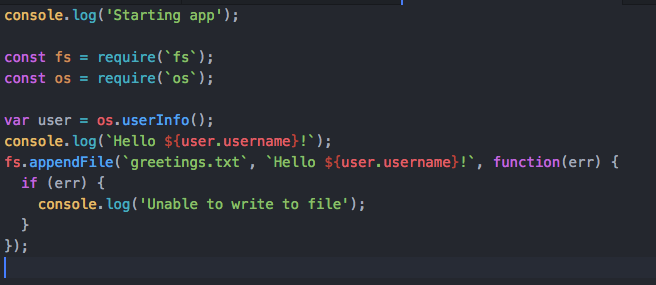
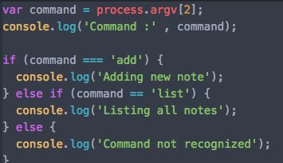
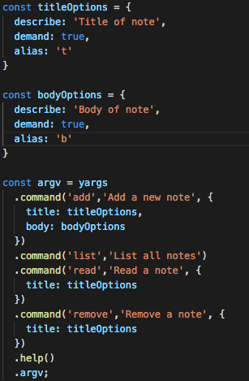

#Section 3

## node.js

> node 란? 자바스크립트 런타임, v-8엔진 사용 - 오픈소스, C++로 작성, 자바스크립트코드를 기계어로 컴파일

	버전정보 - node -v
	node명령창 - node
	
	종료 - process.exit(0) , Control+c, Control+c
	로그 - console.log(‘Hello world!’);
	화면 정보 - global
	프로세스 정보 - process
	
	실행 - node app.js

## node api
<https://nodejs.org/api>

require - 모듈 로드



## lodash
<https://www.npmjs.com/package/lodash>

	npm init
	npm install lodash --save

## nodemon
<https://www.npmjs.com/package/nodemon>

	sudo npm install nodemon -g
	-g 글로벌유틸리티
	sudo 어드민권한으로 실행
	nodemon app.js
-

	node app.js list -> app.js 실행하고 list 실행
	console.log(process.argv); 프로세스 확인



Yargs
	
	npm install yargs@11.1.0 —save


typeof - <https://msdn.microsoft.com/ko-kr/library/259s7zc1(v=vs.94).aspx>

```javascript
var obj = {
  name: 'Jacob'
};
var stringObj = JSON.stringify(obj);
console.log(typeof stringObj);
console.log(stringObj);
```


## 디버그

	node inspect debugging.js
	debug> list(10) ->10줄 디버그
	debug> n -> 다음라인으로 넘어감
	debug> c -> 코드에 debugger 지정된곳으로 이동
	debug> control+c control+c 종료
	debug> repl

-

	nodemon으로 실행 코드 변경시 디버깅이 재시작 된다
	nodemon inspect app.js read --title="hello"
-

크롬으로 디버그
	
	node --inspect-brk playground/debugging.js
<chrome://inspect> 에서 확인

## yargs 옵션


